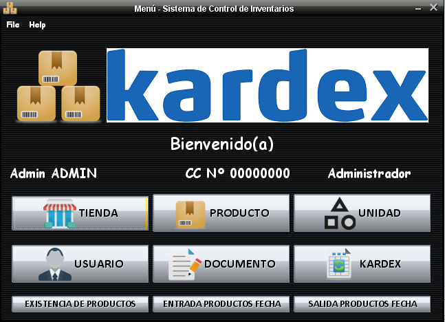

# Inventory Control System.



## Previous requirements:
 - Java JDK 8
 - NetBeans IDE 8.0.2
 - MySQL Server

## Installation:
 - Clone the project in NetBeans.
 
 - Modify the file "HulkStore/HulkStore/connection.dat", with your user data, password and host.
 
 - By default the host is 'jdbc:mysql://localhost:3306/bd_hulkstore?useSSL=false', the user is 'root' and the password 'mySql'.
 
 - Do not leave spaces after the '=' symbol, in addition the data must start from the first line without leaving line breaks before.
 The host can also be the IP address of a remote machine on a local network. Example:
 
 ```sql
  host=jdbc:mysql://localhost:3306/bd_hulkstore?useSSL=false
  usuario=root
  password=mySql

  No editar este archivo.
```
 - Run the SQL scripts on the host's MySQL server, in the following order:
 *buildDatabase.sql*, *triggers.sql*, *views.sql*, *dataDump.sql*

 - When executing the application it is possible to log in with the user *admin* and password *admin*
